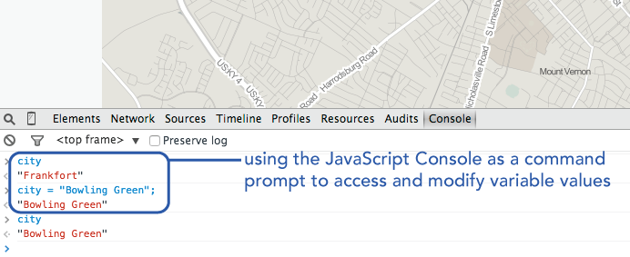

#Module 04: The Building Blocks of Programming: Statements, Expressions, Data Types, Operators, and Variables

##Overview
This lab does the following:

* provides an introduction to programming with Javascript
* introduces the in-browser development tool and JavaScript Console
* introduces the atomic, building-block elements of programming

##Readings and Additional Resources:

* Eloquent JavaScript [Introduction](http://eloquentjavascript.net/00_intro.html), [Chapter 1](http://eloquentjavascript.net/01_values.html), and [Chapter 2](http://eloquentjavascript.net/02_program_structure.html) *Note: this is required reading for the class*
* The Mozilla Developer's Network [JavaScript Guide](https://developer.mozilla.org/en-US/docs/Web/JavaScript/Guide)
* Code Academy's [JavaScript track](http://www.codecademy.com/en/tracks/javascript)

In the previous modules we've already seen how we can use HTML tags to structure our content within a webpage, and how we can then apply CSS style rules to modify the form of this content, or how that content looks (e.g., color, size, etc). These two elements, **content** and **form**, and the relationship between them constitute two fundamental aspects of traditional design. With the web we are able to introduce a third aspect: that of **behavior**. In web mapping and web development in general today, the behavior of a web page or entities within it are controlled by the programming language JavaScript.

This module and the following one provide you with a foundation in computer programming using JavaScript. While we will quickly be looking to apply these practices to web mapping, you first need to gain an understanding of the basics of JavaScript, which can be largely applied to web development in general. If you already know a programming language, then you may find this easier to pick up, though you'll gain from learning the specific syntax with which we write JavaScript, as well as its nuances. If JavaScript is your first programming language, you'll be pleased to know that these programming fundamentals are not unique to JavaScript, but can be applied to the other programming languages as well.

##Dealing with Frustration:
**A word of caution before we begin:** Learning to program a computer is not easy. A good analogy is that it is like learning a language, you have to first learn its general grammar and the specific syntax with which it is written. Then you go out and make a fool of yourself by incorrectly formulating sentences. Great fun! Be sure to try a study abroad program.

Also keep in mind that computers are particularly finicky (seriously they're worse than your most controlling friend or parental figure), and they need things written precisely correct, otherwise our program breaks. BOOM! Except computers don't really go boom. You just end up with some error code.

So, we need to be very careful when we write our code, and as often as we can, write the code **exactly as the examples do.** Seriously, pay attention to whether there are spaces, underscores, capital letters, and semicolons in a line of code. Even one wrong character may produce an error and break your script!

However, the good news is that writing bugs into our programs and creating errors is key part of learning programming. Why is this good news? First, we can feel okay when we don't write perfect code the first time through, because no one does. Second, all programmers have developed strategies for identifying and fixing these bugs, and we'll be explicitly teaching you these strategies as well. Sometimes the computer tells us what went wrong (which error did we make?). Sometimes we don't know exactly what went wrong. But remember, making errors and figuring how to fix these errors (what we call 'debugging') is simply part of programming itself. All programmers, no matter their expertise, unintentionally write errors into their code and spend countless frustrating hours debugging that code. 

The point is, be prepare for your program to break, for you to become frustrated (and even angry at the machine), and for you to be confused about how to fix it. This is expected. So go ahead an decide on your method of dealing with frustation.  Perhaps you can come up with an annoying catch phrase like "Great Flaming Buckets of Lobsters!" that you scream out (try it now and see how you like it) or come up with a frustration dance. We do NOT recommend head-banging but if you are so inclined, invest in some protective headgear.

The best way to learn how to program is to do it. Before we begin writing specific code, though, we want to provide you with a roadmap for the overall learning curve. Remember, the learning curve is steep, and it will take lots of practice and focused concentration to get over it. Seriously, we told you would work hard this semester. But once you do, the feeling of mastering the machine will be worth it. 

Take a look at the overall learning curve/trajectory (Figure 04-1). Don't worry if you're not sure what all this stuff is, because once we introduce all these aspects and have you work through this stuff it will make sense and get them right.


Figure 04-1. The JavaScript Learning Curve as instructed in Geo409

By the end of these modules, you'll be familiar with the following terms and how they all relate together to make the program run.

##In browser development tool and console

Before we get into actually programming, we need to introduce one more piece of our development environment puzzle: our web browser development tools and the JavaScript Console. The console is useful for letting us look "beneath" the webpage, as well as letting our JavaScript "talk" to our web browser.  You've been using browsers for years but likely have never really looked at this, so welcome to the *secret community of the console*! Which actually doesn't exist but sounds cool, so let's pretend.

For many years, development tools and a JavaScript Console existed as additional plugins that web designers and developers could install in their browser. Most modern browsers of today (i.e., Chrome, Firefox, Safari, IE10+) come with these tools built into the browser itself. We'll be exploring these tools in greater detail through the course, but for now, we want to get to know our browser JavaScript Console. 

Let's begin by opening one of your index.html pages from your previous tasks in Chrome (It is easiest to use Live Preview in Brackets). Btw, we'll be using Chrome in our examples so we strongly advise that you use this browser as well. To open the browser JavaScript Console, click the settings tool in the upper right corner of the browser and select ***more tools*** and then choose ***JavaScript Console***. Note that you can also use keyboard shortcuts to do this, Windows: F12, Ctrl + Shift + I and Mac: Cmd + Opt + I (Read more about [Keyboard Shortcuts in Chrome](https://developer.chrome.com/devtools/docs/shortcuts)).


Figure 04-2. Accessing the Console within Chrome's built-in web development tools.

We can use the JavaScript console in two ways:

1. directly entering statements into the console itself within the browser (a.k.a. a command prompt), or
2. logging information from our JavaScript code to the browser Console

We'll primarily be doing the latter, as it's a fundamental part of JavaScript development and web mapping.

Read more about using the [JavaScript Console in Chrome](https://developer.chrome.com/devtools/docs/console).

To do this, we make use of a special method named *log()*. We'll talk in more detail later about what a "method" is. For the moment know that this bit of JavaScript code (or method) prints information to the JavaScript console:

```javascript
console.log("console value goes here");
```

We'll have a better understanding of the specific syntax of this statement when we cover functions and methods in module 7. For now, it's important to note that the opening and closing parenthesis are important. This statement will attempt to log whatever is between them to the JavaScript Console. So, just like html tags or the curly braces of a CSS declaration, it's important to ensure an opening parenthesis is always followed by a closing one.

Let's get started, shall we?

**Instructions:** To follow along with this module, first be sure to clone ("sync") the [https://github.com/newmapsplus/geo409](https://github.com/newmapsplus/geo409) repository. This will copy down any new files/directories we've added to the repository. Once you've synced the newmapsplus/geo409 repository, you'll want to manually copy over the module-04 directory into your own local repository (do this within your windows directory (or Finder if using a Mac). Ensure that you have the module-04 directory now within your local file/directory structure. **DOUBLE AND TRIPLE CHECK THIS! It is a common thing to mess up and if you don't do it correctly, you will cause yourself grief.**

###comments

Often when we write code, we wish to either make notes for ourselves and other others who may read our code, or to temporarily disable lines of code from executing. To do this, we make use of **comments**.  We've already seen how to comment out lines of code in HTML and CSS. In JavaScript there are two ways to comment out code:

1. Use two forward slashes to comment out a single line of code:


```javascript
// this is a JavaScript comment
```
    

2. Or, use the following syntax to comment out a block of code, which will prevent all the statements contained within it from executing:

```javascript

    /*
    var state = "KY";
    var city = "Lexington";
    var cityPop = 301569;  
    console.log(city + " is a city in "+ state + "and has a population of "+ cityPop);	 
    */
```

Note that when using a text editor like Brackets, you can quickly comment and uncomment individual lines and blocks of code by highlighting them and using a keyboard shortcut (Ctr+/). This is really useful during debugging when you're trying to figure out what is not working. By commenting out sections and lines you can test each part separately.

##The atomic elements of programming

When we write JavaScript code, we write ***statements***. Statements are like sentences in computer programming. To make the computer do something, we have it execute a statement. To begin, let's first write a statement that prints a message to the JavaScript Console. Statements in JavaScript generally end with a semicolon. Write the following statement in your index.html file (or any convenient file) within the `<script></script>` tags, which are located toward the bottom of the HTML document within the `<body></body>` tags:

```javascript
console.log("Hello Map");
```

Save the file and refresh your browser to check the output in the JavaScript Console. We should see our message there. 

**Note:** Get use to this. You'll be repeating this process indefinitely as you develop web maps and applications:

1. edit the code in your text editor (e.g., Brackets)
2. save the file
3. refresh the browser to view output in the browser or the development tool/Console

This is how we'll be making and testing maps.

###Values and types

When we logged the text "Hello Map" to our browser's JavaScript Console above, the "Hello Map" text string is considered a ***value***. Values are the bits of data that we wish to encode, manipulate, and represent within our maps and data visualizations. They're the whole point of why we're mapping! But not all values are the same.

In JavaScript, our values have different **types**. Remember the quotations around the text *Hello Map* in the previous example? The quotations indicate that our value of *Hello Map* is a *string* **type**. A String type means it is text and so JavaScript will treat like text rather than something else, like a number. Try taking out the quotations around *Hello Map*, save your file and refresh the browser. You will see some kind error show up, because with that small change JavaScript no longer knows that this is a *string* **type**.  Be sure to fix this before going on.

A couple other examples will help us understand how values have different types.

Next type in the following statement, save your changes, and refresh your browser:

```javascript
console.log(5);  // output is 5
```
You should see the number 5 output in the Console. The value 5 is, not surprisingly, a ***numeric data type***. We notice that the value *5* does not have quotation marks around it, and therefore not not a String type. And while *5* makes sense as a number, *Hello Map* (without the quotes) does NOT make sense of as a number.

Note that JavaScript can also handle fractional numbers using a decimal point, as well as exponents:


```javascript
console.log(5.5); // output is 5.5
console.log(5e10); // output is 50000000000
```

We encode much of our geographic data either as text (i.e., string types) or numbers (i.e., numerical or number types). This distinction may seem simple and obvious now, but can wreak havoc if you are not careful. So, always pay attention to the type of your data! 

One other value we use frequently when programming: that of the **Boolean** (or Logical) type which is used to represent either true (1) or false (0). This means the terms true and false have special meaning in JavaScript and if include them without quotes they will be treated as a statement rather than an error. Try the statements below:

```javascript
console.log(true);
console.log(false);
```

```javascript
console.log(true); // OK even WITHOUT quotes because this is Boolean (not text) type
```

And then change true to truelove

```javascript
console.log(truelove); // ERROR WITHOUT quotes because truelove is NOT a Boolean value
```

Perhaps a big sad for the romatics out there but a key distinction in programming.   We'll be exploring Boolean values more in the next section.

###Expressions and operators

Numbers and strings may look fairly similar when printed to our JavaScript Console. For example. the numeric value of 5 and a string value of "5" look very similar to us, but the computer sees these as very different. To explore this, we'll introduce another programming term, the ***operator***. What's an operator? Quite simply, operators perform operations on values ... they *do things to values*.

We're already very familiar the such operators we use in basic mathematical **expressions**. An expression is JavaScript code that resolves to a value.

Write this code in your file, save, and refresh the browser to see the output in the Console:

```javascript
console.log(5 + 8); // output will be 13
```

The plus sign there is an operator that forms an expression, which in this case adds the two numbers together. The value of this expression is the numerical type 13. We have just turned the computer into a very expensive calculator! Progress!

Read more about [arithmetic operators](https://developer.mozilla.org/en-US/docs/Web/JavaScript/Guide/Expressions_and_Operators#Arithmetic_operators).

In addition to basic **arithmetic operators** (i.e., for addition, subtraction, multiplication, division), we often use **comparison operators**, which compare values and return a local (i.e., Boolean) value of either true or false.

You could type the following expressings into your index.html file (surrounde by a `<script>` tag, save and refresh the browser to see the effect. OR you could simple log them directly into your browser's console.  This means type them into the console window at the little blinking prompt.  This will NOT save them to your file but you can use it to test Javascript.

[screen grab here]

So, log the following expressions to your browser's Console:

```javascript
console.log(5 < 8); // evaluates to true
console.log(5 > 8); // evaluates to false
console.log(5 == 8); // evaluates to false
console.log(5 != 8); // evaluates to true
```

Read more about [comparison operators](https://developer.mozilla.org/en-US/docs/Web/JavaScript/Guide/Expressions_and_Operators#Comparison_operators).

Note that we can also use operators on String types:

```javascript
console.log("My name is "+ "Ate Poorthuis");
```
Type this in the console and you will see it outputs

My name is Ate Poorthuis

The two text strings "My name is " and "Ate Poorthuis" were stuck together.

The plus sign, when used as an operator on String types, behaves differently than on Number types. Rather than performing a mathematical calculation the text was joined.

This is a key idea so, let's say this again to be clear: **operators behave differently on different data types.**

Things can get a little tricky, so pay close attention. Log the following expression to your console:

```javascript
console.log(5 + "8"); // output is 58
```

What is the result? This may not be what we expected. Rather than adding these two different types (a number and a string) together, JavaScript converts the numerical value of 5 into a string type, and then concatenates the two together as a string. This is one instance of when paying attention to data types is really important. Say we had a more complex program that was loading in larger datasets, and we wanted the script to aggregate some totals. If one data set was encoded as numbers and the other as string types, the program would go ahead and produce the wrong results! We may not even notice.

The lesson is that JavaScript operators convert data types. Note the same thing happens in this example, though it is more clear what has happened:

```javascript
console.log(5 + "Hello Map"); // output is a string value "5Hello Map"
```

What happens when we apply our comparison operators to this case of mixed data types? Consider the following output:


```javascript
console.log(5 < "8"); // output is true
console.log(5 > "8"); // output is false
console.log(5 == "5"); // output is true!?!?!
```

When comparing a number and a string, JavaScript converts the string to a number to make the comparison. This makes sense then, in terms of these three examples because the expressions are evaluating those values as numbers. So while the arithmetic operator (the `+` sign) converted the number to a string, the comparison operator (`<` or `>`) converted the string to a number! 

Read more about [data type conversion](https://developer.mozilla.org/en-US/docs/Web/JavaScript/Guide/Values,_variables,_and_literals#Data_type_conversion) in JavaScript.  All kinds of fun stuff.

Take special note with the third example above. In JavaScript, and most programming lanuages, when we want to test if two values are equivalent, we use a double equals sign `==` to make the test.  A single equals sign `=` is used as a different operator (discussed below) and mixing this up will cause problems.  And if we really need to compare a number with it's string type equivalent, use a three-character equals sign `===`:
Take special note with the third example above. In JavaScript, and most programming lanuages, when we want to test if two values are equivalent, we use a double equals sign `==` to make the test.  A single equals sign `=` is used as a different operator (discussed below) and mixing this up will cause problems.  And if we really need to compare a number with it's string type equivalent, use a three-character equals sign `===`:

```javascript
console.log(5 === "5"); // output is false
```

There is a third category of operators that we regularly use. Logical operators consist of AND (`&&`), OR (`||`), and NOT (`!`).

Consider the following statements using logical operators of AND and OR:

```javascript
console.log(1 < 2 && 2 < 3); // output is true because 1 < 2 and 2 < 3
console.log(1 < 2 && 2 > 3); // output is false because the second statement (2 >3) is not true
console.log(1 < 2 || 2 > 3); // output is true because only one of the statements need be true
```

The NOT operator is usually prepended to a value to incur its opposite. We also use it to determine if a value is NOT equal to another value:

```javascript
console.log(!true); // output is false
console.log(1 != 2); // output is true because 1 is NOT 2
console.log(1 != 1); // output is false because 1 is 1
```

###Variables

In term of programming, however, all these `console.log();` statements doesn't do us much good though, to simply log values out to the Console. We need a way to store these values, even temporarily, as the script runs. This is where **variables** come into play. Variables allow us to store references to values. We *declare* a new variable using the JavaScript keyword *var*. This can be done in a simple statement:

```javascript
var city;
```

You might remember this from when talked about the `var map;` in the last module and how it was tied to HTML and CCS.

While you can use almost anything for a variable names it is really important to choose names that are semantically meaningful and useful within the program. Choose names that describe the value they refer to. After all, calling a variable `map` rather than `jacktheiguana` or `dasf3432489jfff` gives you (and anyone you are working with) a much better sense of what role the variable plays in the program.

Beyond this, variable names can not begin with a number, and **cannot be one of JavaScript's reserved keywords**:

<blockquote>
break case catch class const continue debugger
default delete do else enum export extends false
finally for function if implements import in
instanceof interface let new null package private
protected public return static super switch this
throw true try typeof var void while with yield
</blockquote>

It is useful to keep some basic things in mind when choosing variable names. While you can use underscores or hyphens in variable names, the general convention is to use what's known as camelCase, that is, the first letter of the variable begins with a lowercase, and subsequent words within the variable name are concatenated and capitalized (do not use spaces within variable names). The following variable declarations illustrate the use of camelCase to write semantically meaningful variable names:

```javascript
var city;
var myCity;
var myFavoriteCity;
var myFavoriteIguanaCity // Although descriptive, it is getting a bit long
```
After declaring the variable, we can then *assign* a value to that variable by using a single *=* sign, an *assignment operator* and the following expression:

```javascript
var city;
city = "Lexington"
console.log(city);
```

**Note:** This is how a single equal sign `=` differs from a double equal sign `==`. Also, the variable name must always exist to the left of the *=* sign, and not the other way around.


We can also declare a variable name and assign a value to it within a single statement (which is  more efficient):

```javascript
var city = "Lexington";
console.log(city);
```

Let's practice declaring more variables and assigning values of various types to them. Type the following JavaScript code in your index.html file, save the file, and refresh your browser to see the results. Get use to this process, as we'll be doing it a lot while we develop web maps.

```javascript
var city = "Frankfort";		
var state = "Kentucky";
console.log(city, ', ',state); 
var isCapital = true;  
```

We often assign the value of an expression to variable names as well:

```javascript
var value1 = 30;
var value2 = 60;
var total = value1 + value2;
console.log(total);
var average = value1/value2;
console.log(average);
```

Note that we can also change the value (or re-assign) the value of a variable:

```javascript
var year = 2014;
console.log(year);
var year = year + 1;
console.log(year);
```

Also note that when we console.log(), we sometimes include expressions using multiple data types within it, separated by commas, such as writing a string and then following that with a value referred to by a variable:

```javascript
var cityPop = 308428;
console.log("The population of lexington is ", cityPop);
```
Just a quick note here that our JavaScript Console is more than just an output field for using the console.log() statements within our script. It can also be used as an interactive command prompt itself, which has access to the internal state of the script as executed within our HTML document. So, for example, if we've declare and defined such variables as `city` or `cityPop`, as demonstrated above, within our script (and refreshed the browser), we still have access to these values within the JavaScript Console.

For example, within the console itself, try typing the word `city`. We see the value outputed within the Console. We can also change the value of these values as well, for example by typing `city = "Bowling Green";` This changes the value of the variable named `city` to a new string value.



Given what you've learned in this lab instruction, continue to the task-c.md file located at [https://github.com/newmapsplus/geo409/session-04/task-c.md]

***Glossary***

* **Console**: provides output for diagnostic testing using such methods as console.log(), as well as a shell prompt within the web browser
* **statement**: a "complete sentence" within a programming language
* **value**: a piece of data or information
* **data type**: a category of a data value that determines its role within a program and what operators apply to it
* **string type** a data type representing text
* **numeric type**: a data type representing a number
* **Boolean type**: a data type representing a binary 1 or zero, on, or off, true or false
* **operator**: piece of code native to JavaScript that performs operations on data values 
* **expression**: a unit of code that resolves to a value
